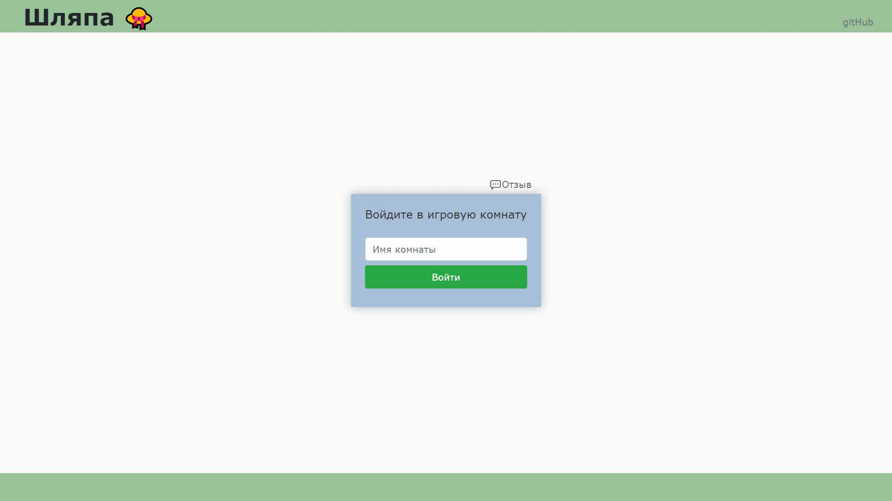
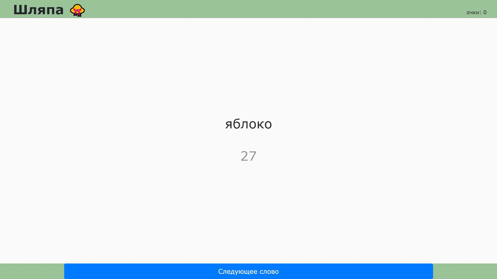
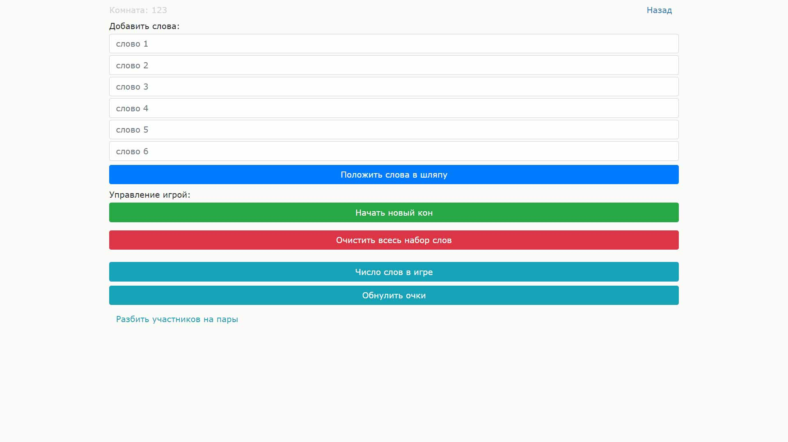
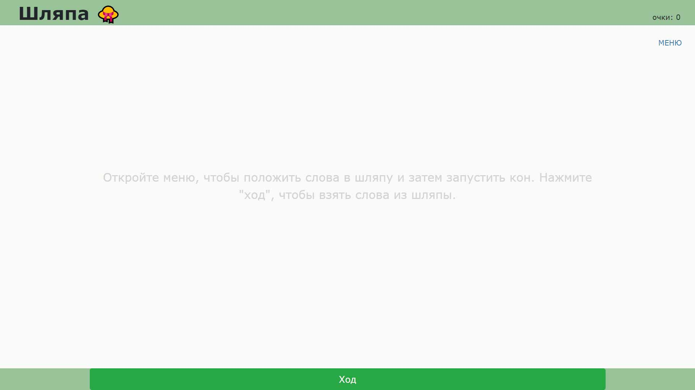

# Веб-приложение для игры в шляпу

## Об игре

Шляпа - интересная и веселая игра для компании. Цель игры – за ограниченное время объяснить партнёру или команде как можно больше слов вытянутых из шляпы.

Для игры в шляпу требуются:
сама шляпа (подойдет кастрюля или миска);
бумажки со словами для шляпы;
часы, чтобы засекать время.

Все участники придумывают по десять слов и пишут их на бумажках. Показывать бумажки никому нельзя. Используются только нарицательные существительные в именительном падеже и единственном числе.

Когда слова в шляпе, игроки случайным образом делятся на команды.
Перед стартом каждого кона засекается время - обычно полминуты. Один из игроков команды вынимает из шляпы бумажку и объясняет написанное на ней слово партнеру.

[Подробнее тут.](https://shlyapa-game.ru/rules)

## Описание приложения

### Предназначение

**Данное приложение позволяет играть в шляпу дистанционно, заменяя собой шляпу, бумажки и часы, а так же распределяя участников по командам.**

### Использование

Первым делом пользователи вводят общее для всех участников название игровой комнаты, то есть имя файла на сервере, в котором будет храниться набор слов. Это позволяет играть нескольким отдельным группам одновременно в разных "комнатах", не мешая друг другу.

Затем участники вводят слова и "кладут их в шляпу", после чего один из них нажимает кнопку "начать новый кон", чтобы слова можно было "достать из шляпы".

Когда слова в шляпе, с помощью соответствующей кнопки в меню участники разбиваются на пары.

Игроки ходят по очереди. Обьясняющий нажимает кнопку "ход", чтобы запустить таймер, начать обьяснять напарнику и "достать из шляпы" первое слово. Когда слово обьяснено, игрок нажимает кнопку "следующее слово" и продолжает обьяснять. По истечению времени таймера у игрока есть время, чтобы успеть нажать кнопку, если слово отгаданно. Новое слово при этом не отобразится и ход завершится.

Когда слова в шляпе закончатся, "ходящий" игрок будет информирован об этом и кон завершится. После этого можно начать новый кон с тем же набором слов или очистить набор слов с помощью соответствующей кнопки.

Каждый пользователь может видеть число своих очков (отгаданных его напарником слов), то есть сколько раз он нажимал кнопку "следующее слово". Число очков сохраняется и суммируется в разных конах и при перезагруке сайта. Его можно обнулить с помощью соответствующей кнопки.

Для дистанционной игры удобно использовать конференцию Zoom.

### Подробнее о приложении

Бекенд, отвечающий за комнаты, запись и распределение слов, написан на PHP.
Фронтенд реализован одной страницей, функционал написан на JavaScript. Для верстки использован Bootstrap.

## Скриншоты

## Попробовать можно по ссылкам

[shlyapa-game.herokuapp.com](https://shlyapa-game.herokuapp.com/)
[shlyapa.std-1033.ist.mospolytech.ru](http://shlyapa.std-1033.ist.mospolytech.ru/)
